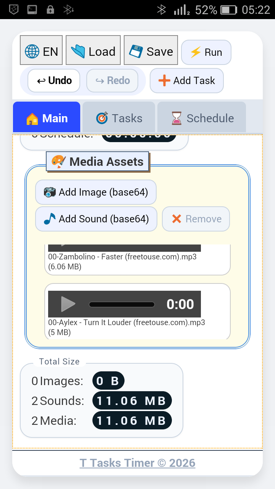
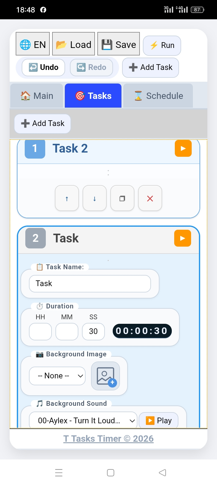

# T-Tasks-Timer

  <a href="#english">🇬🇧 English</a> • 
  <a href="#français">🇫🇷 Français</a> • 
  <a href="#العربية">🇩🇿 العربية</a>

---

## 🇬🇧 English

### About the Project
**T-Tasks-Timer** is a lightweight, responsive HTML5 web application designed to help users manage and time their tasks efficiently. Built with clean web technologies, it is optimized for high performance and accessibility.

* **Live Demo:** [View App Live](https://am-trouzine.github.io/T-Tasks-Timer/)
* **Android App:** [Download APK (Beta/Debug)](https://github.com/am-trouzine/T-Tasks-Timer/releases/download/v1.0.0/app_debug.apk)
* **Features:** Clear visual countdowns, sequential task management, and an adaptive user interface.

### How to Run Locally
1. Clone the repository: `git clone https://github.com/am-trouzine/T-Tasks-Timer.git`
2. Open `index.html` directly in any modern web browser.

---

## 🇫🇷 Français

### À propos du projet
**T-Tasks-Timer** est une application web HTML5 légère et réactive, conçue pour aider les utilisateurs à gérer et chronométrer leurs tâches efficacement. Développée avec des technologies web épurées, elle est optimisée pour une accessibilité et des performances élevées.

* **Démo en direct :** [Lire en français / Voir l'application](https://am-trouzine.github.io/T-Tasks-Timer/)
* **Application Android :** [Télécharger l'APK (Bêta/Debug)](https://github.com/am-trouzine/T-Tasks-Timer/releases/download/v1.0.0/app_debug.apk)
* **Fonctionnalités :** Comptes à rebours visuels clairs, gestion séquentielle des tâches et interface utilisateur adaptative.

### Comment exécuter localement
1. Cloner le dépôt : `git clone https://github.com/am-trouzine/T-Tasks-Timer.git`
2. Ouvrir le fichier `index.html` directement dans votre navigateur.

---

## 🇩🇿 العربية

### عن المشروع
تطبيق **T-Tasks-Timer** هو تطبيق ويب خفيف ومستجيب مبني بتقنيات HTML5، مصمم لمساعدة المستخدمين على إدارة وتوقيت مهامهم بكفاءة. تم تطويره باستخدام تقنيات الويب الأساسية لضمان الأداء العالي وسهولة الوصول.

* **العرض المباشر:** [تجرية التطبيق مباشرة](https://am-trouzine.github.io/T-Tasks-Timer/)
* **تطبيق أندرويد:** [تحميل ملف APK (نسخة تجريبية)](https://github.com/am-trouzine/T-Tasks-Timer/releases/download/v1.0.0/app_debug.apk)
* **الميزات:** عد تنازلي مرئي واضح، إدارة متتالية للمهام، وواجهة مستخدم متكيفة.

### التشغيل المحلي
1. استنساخ المستودع: `git clone https://github.com/am-trouzine/T-Tasks-Timer.git`
2. افتح ملف `index.html` مباشرة في أي متصفح ويب.

---

### Screenshots / لقطات شاشة

| Android 4.4.2 (KitKat) | Android 13 (Modern) | PC Browser |
| :---: | :---: | :---: |
|  |  |  |
